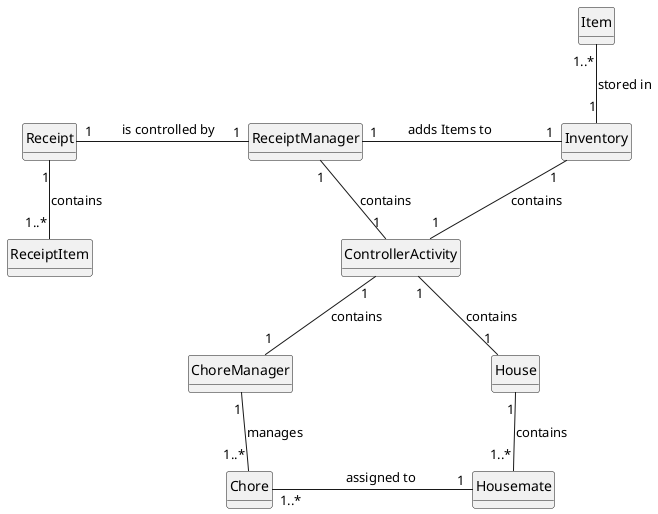
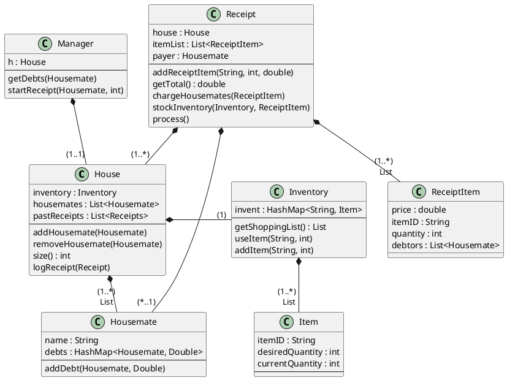

#Domain Model:

```plantuml
@startuml

hide circle
hide empty methods

'classes

class Inventory{}
class Item{}
class Receipt{}
Class Housemate{}
Class ControllerActivity{}      
Class House{}
Class ReceiptItem{}    
Class ReceiptManager{}
Class ChoreManager{}

    
' Associations
 
ControllerActivity "1" -right- "1" House : contains
ControllerActivity "1" -up- "1" Inventory : contains
ControllerActivity "1" -left- "1" ReceiptManager : contains
ControllerActivity "1" -down- "1" ChoreManager : contains
Inventory "1" -up- "1..*" Item : stored in
House "1" - "1..*" Housemate : contains
ChoreManager "1" -down- "1..*" Chore : manages
ReceiptManager "1" -left- "1" Receipt : \tis controlled by\t
Receipt "1" -- "1..*" ReceiptItem : contains
ReceiptManager "1" - "1" Inventory : \tadds Items to\t\t
Chore"1..*" - "1" Housemate : \t\tassigned to \t\t
ChoreManager -[hidden]right- House : \t\tassigned to \t\t

 
 @enduml
 ```

#Sequence Diagram

```plantuml

 'Sequence Diagram
 
 hide footbox

participant " : House" as House
participant " : Housemate" as Housemate
participant " : ReceiptManager" as ReceiptManager
participant " : Receipt" as Receipt
participant " : Inventory" as Inventory
participant " : ShoppingList" as ShoppingList
participant " : Item" as Item
participant " : ChoreManager" as ChoreManager
participant " : Chore" as Chore 


House -> Housemate : addHousemate()
House -> Housemate : removeHousemate()
ChoreManager -> Chore : addChore()
ChoreManager -> Chore : removeChore()
ReceiptManager -> Receipt : startReceipt()
ReceiptManager -> Receipt : addItem()
ReceiptManager -> Receipt : removeItem()
ReceiptManager -> Receipt : itemsDone()
ReceiptManager -> Receipt : endReceipt()
Receipt -> Inventory : process()
Inventory -> Inventory : addItem()
Inventory <- Inventory : removeItem()
Inventory -> ShoppingList : getShoppingList()
ShoppingList -> Item : subDesired()
ShoppingList -> Item : addDesired()


```

#Class Diagram:

```plantuml
@startUML

class House{
   inventory : Inventory
   housemates : List<Housemate>
   pastReceipts : List<Receipts>
   --
   addHousemate(Housemate)
   removeHousemate(Housemate)
   size() : int
   logReceipt(Receipt)
}

class Inventory{
    invent : HashMap<String, Item>
    --
    getShoppingList() : List
    useItem(String, int)
    addItem(String, int)
}

class Housemate {
    name : String
    debts : HashMap<Housemate, Double>
    --
    addDebt(Housemate, Double)
}

class Receipt{
    house : House
    itemList : List<ReceiptItem>
    payer : Housemate
    --
    addReceiptItem(String, int, double)
    getTotal() : double
    chargeHousemates(ReceiptItem)
    stockInventory(Inventory, ReceiptItem)
    process()
}

class ReceiptItem{
    price : double
    itemID : String
    quantity : int
    debtors : List<Housemate>
    
}

class Item{
    itemID : String
    desiredQuantity : int
    currentQuantity : int
    --
}


'class Debt{
'   Debtor : Housemate
'   Creditor : Housemate
'   amount: double
'    --
'}

class Manager {
    h : House
    --
    getDebts(Housemate)
    startReceipt(Housemate, int)
}

House *-"(1)" Inventory
House *--"(1..*)\nList" Housemate
Inventory *-- "(1..*) \n List" Item
Receipt *-- "(1..*) \n List" ReceiptItem
Receipt *-- "(1..*)" House
Manager *-- "(1..1)" House
Receipt *-- "(*..1)" Housemate
```
